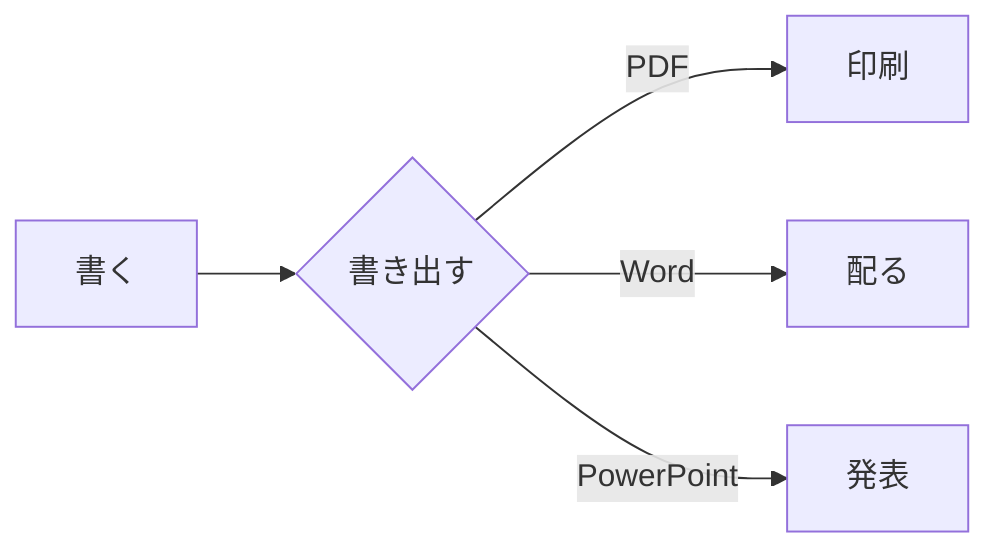
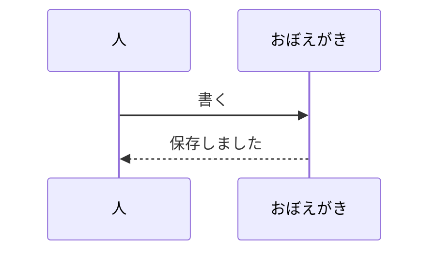

# 書き出しの見本

このノートは **PDF・Word・PowerPoint・HTML** への書き出しを確かめるための
見本です。書き出したものを開いて、下の一覧と見比べてください。
`fixtures/samples/読み込みの見本/` には取り込みを試す資料が入っています。

2026-09-13 / おぼえがきチーム

## 文字の修飾

**太字**と*斜体*と***太字の斜体***、~~打ち消し~~、::マーカー::、
`インラインコード`、そして <span style="color: #c0392b">赤い字</span>と
<span style="color: #1E2761">濃い青の字</span>（ADR-0061 で受ける形だけ）。

行の途中で改行を入れると  
このように続きます（行末に空白 2 つ）。

[外のリンク](https://example.com) と、ノートへのリンク
[[おぼえがきの使い方]]、別名つきの [[おぼえがきの使い方|手引き]]。
裸の URL も https://example.com/ のまま書けます。

脚注も使えます[^1]。

[^1]: 脚注の中身。HTML では末尾に集められます。

## 見出しの深さ

### 見出し 3

段落です。**PowerPoint では**、見出し 2 ごとに 1 枚へ割れます（既定）。

#### 見出し 4

段落です。

## 箇条書きとやること

- 一段目
  - 二段目
    - 三段目
- **修飾の入った**項目と `コード`
1. 番号つき
2. 二つ目
   1. 入れ子の番号

- [ ] 未完了のやること
- [x] 済んだやること
- [ ] 期限つき 2026-09-30

## 引用と囲み

> 引用です。PowerPoint では**発表者ノート**に回ります。
> 2 行目もノートに入ります。

:::note info
情報の囲み（Qiita 記法）。HTML と Word では枠になります。
:::

:::note warn
注意の囲み。
:::

:::details 畳んである説明
畳みの中には**本文**も `コード` も入れられます。

- 箇条書きも入ります
:::

## 表

| 項目     | 内容                   |   数値 |
| -------- | ---------------------- | -----: |
| 文字     | 日本語と English       |     12 |
| 記号     | `コード` と **太字**   |  3,456 |
| 空のセル |                        |      0 |

## コード

```python:sample.py
def greet(name: str) -> str:
    """あいさつを返す。"""
    return f"こんにちは、{name}さん"


print(greet("世界"))
```

```
言語を書かないブロック。
色は付かず、等幅のまま出ます。
```

## 数式

文の中の数式 $e^{i\pi} + 1 = 0$ と、独立した数式:

$$
\int_{0}^{\infty} e^{-x^2} \, dx = \frac{\sqrt{\pi}}{2}
$$

## 図（Mermaid）





## 画像


説明（キャプション）は絵の下に出ます。`|320` は幅の指定です。

---

## 区切りのあと

水平線の下の段落。ここまでが 1 枚のノートです。

#見本 #書き出し
