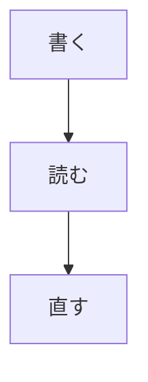

# 覚書の使い方

ようこそ。このノート自体が Markdown で書かれているので、**書き方の見本**にも
なります。不要になったらゴミ箱へ入れてください。

**このノートは置き直せます。** 「ヘルプ」→「使い方のノートを置き直す」で
最新版が出ます（いま開いているノートは消えず、別のファイルとして置かれます）。

## このアプリの考え方

編集画面とプレビュー画面が分かれていません。書きながら装飾が反映されます。

記号（`**` や `#`）は**カーソルがその要素の外にあるとき隠れます**。中に入れると
現れて、そのまま直せます。この行の *斜体* や `コード` にカーソルを合わせて
みてください。

ノートは**素の `.md` ファイル**として保存されます。独自形式は使いません。
保管フォルダを Finder で開けば、そのまま他のアプリでも読めます。

打ち終えて 0.8 秒で自動保存されます（`Cmd+S` でいつでも書き切れます）。

## 画面の見方

左が**ノートの一覧**、右が**本文**です。一覧の上の欄で検索、下にタグと
ゴミ箱が並びます。

| ところ       | できること                                       |
| ------------ | ------------------------------------------------ |
| ＋ 新規      | 新しいノートを作る（`Cmd+N`）                    |
| 検索欄       | 全ノートの本文から探す（`Cmd+Shift+F`）          |
| 並び順       | 更新順 / 名前順を選ぶ（選んだものを覚えます）    |
| タグ         | 本文に書いたタグ。押すとそのタグのノートだけ出る |
| ゴミ箱       | 捨てたノート（30 日で自動削除）                  |

`Cmd+1` でフォルダ・タグ・ゴミ箱の並び、`Cmd+2` でノートの一覧を
出し入れできます（両方閉じると**本文だけ**になります）。境目をドラッグ
すると幅が変えられ、次に開いたときも覚えています。

一覧のノートを**右クリック**すると、ピン留め・複製・フォルダへ移動・
テンプレートに登録・リンク（`[[名前]]`）のコピー・Finder で表示・
ゴミ箱へ移動ができます。

本文の上には題名の欄があります。**題名を直すとファイル名も変わり**、本文の
先頭の見出しも一緒に書き換わります。
その右のボタンで、ピン留め（一覧の先頭に固定）・HTML 書き出し・版の履歴・
ゴミ箱への移動ができます。

## 書き方

### 文字の装飾

これは **強調**、これは *斜体*、これは ~~打ち消し~~、これは ::マーカー::、
そしてこれは `インラインコード` です。

日本語でも**前後に空白を入れずに**装飾できます。「**強調**」のように括弧に
隣接しても効きます（`_` は英語の綴りを壊さないよう、空白で挟んだときだけ
効きます）。

### 箇条書きとタスク

- 項目を書いて Enter を押すと、次の行にも `- ` が付きます
- Tab で字下げ、Shift+Tab で戻せます
  - 入れ子にした項目
- 空の項目で Enter を 2 回押すと、ふつうの段落に戻ります

1. 番号付きの箇条書き
2. 番号は自動で 1 つ進みます

- [ ] まだ終わっていない項目
- [x] 終わった項目

**チェックの印はクリックで切り替わります**（`Cmd+Shift+T` でも）。

選んだ行に対して、「編集」メニューから箇条書き・番号・引用をまとめて
付け外しできます。「見出し」は押すたびに 段落 → H1 → H2 → H3 → 段落 と
回ります。

### 引用とコード

> 引用は左に縦線が付きます。
> 行末で Enter を押すと引用が続きます。

```python
def hello() -> str:
    """コードブロックの中では装飾が一切効きません。"""
    return "**これは強調になりません**"
```

コードの中で Enter を押すと、**前の行の字下げがそのまま続きます**。
言語を書くと**予約語や文字列に色が付きます**（`python` `javascript` `json`
`bash` `rust` など。`py` `js` `sh` のような別名も効きます）。知らない
言語名を書いてもエラーにはならず、色なしで表示されます。

フェンスの行に `python:app.py` のように書くと、**ファイル名のラベル**が
付きます。

### 表

「編集」→「表を挿入…」で行と列を決めて作れます。

| 項目 | 内容                  |
| ---- | --------------------- |
| 期間 | 2026 年 1 月 〜 12 月 |
| 担当 | 覚書チーム            |

書いている間は素の Markdown のまま、**カーソルが表から離れると桁が揃い、
表として描かれます**。セルの中で改行したいときは `<br>` を入れてください。

### 図（Mermaid）

コードブロックの言語を `mermaid` にすると、図として描かれます。



カーソルをブロックに入れると**書いたコードに戻る**ので、そのまま直せます。
描けないコードはコードのまま出ます。図を含むノートを HTML に書き出すと、
図はそのまま絵として埋め込まれます。

### 数式

`$E = mc^2$` のように `$` で挟むと数式になります。行を分けて書くときは
`$$` だけの行で挟みます。

$$
\frac{a}{b} = \sum_{i=1}^{n} x_i
$$

カーソルを式に入れると**書いた LaTeX に戻る**ので、そのまま直せます。
組めない式（閉じ忘れなど）は組まずにそのまま出るので、どこが違うか
分かります。値段の `$100` は数式になりません。

### 見出しの折りたたみ

見出しの行の左端（行番号のあたり）に ▾ が出ます。押すと、その見出しから
次の同じ深さの見出しまでが畳まれます。畳んだ状態はノートを開き直すと
戻ります。

### 画像

画像はコピーして**本文に貼り付ける**か、ファイルを**ドラッグして落とす**と
保管フォルダの `attachments/` に保存され、`` が入ります。
書いた場所にそのまま絵として出ます。

使わなくなった画像は、「ファイル」→「使っていない添付を片づける…」で
まとめてゴミ箱へ移せます。**どのノートからも指されていないものだけ**が
対象で、ゴミ箱の中のノートや雛形から指されているものは残ります。

### リンクとタグ

- `[覚書](https://example.com)` のように書けます。**URL を選択の上に貼る**と
  `[選んだ文字](URL)` になります
- URL をそのまま書いてもリンクになります
- `Cmd` を押しながらクリックすると、ブラウザで開きます
- `[[ノートの題名]]` で**ノート同士を繋げます**。`Cmd+クリック`で開き、
  **無ければその題名で作ります**
- 本文に `#` から始まる語を書くと**タグ**になります（`#` の直前は行頭か
  空白、`#見出し` とは区別されます）。`/` で階層にできます
- タグは打ちかけると**候補が出ます**。↑↓ で選んで Enter か Tab で確定、
  Esc で閉じます
- タグを `Cmd+クリック`するか、一覧の下のタグを押すと、**そのタグ（と
  その下の階層）のノートだけ**に絞られます。もう一度押すと解除です
- 脚注は `[^1]` のように書くと小さく上付きで出ます

### ノートの先頭の設定（front matter）

ノートの先頭に `---` で挟んだ行があると、**設定**として扱われて画面からは
隠れます。ピン留め（`pinned: true`）はここに書かれます。手で書き足しても
かまいません。

## テンプレートと今日のノート

**`Cmd+Shift+N` でテンプレートから作れます。** 「日次」「議事録」「日報」の
3 つが最初から入っています。選ぶとすぐ書き始められる場所にカーソルが来ます。
**題名は聞きません** — 雛形の名前がそのまま題名になります。上の題名の欄で
直せば、本文の見出しも一緒に変わります。

**`Cmd+T` で今日のノートが開きます。** 無ければ `2026-09-03` のような日付の
題名で作ります。**同じ日に何度押しても同じノートが開きます**（書いたものが
2 つに割れません）。テンプレートの「日次」がそのまま使われます。

テンプレートは保管フォルダの `templates/` にある**ただの `.md`** です。
Finder で足せばそのまま候補に出ますし、中身を直せば次から反映されます。
**テンプレートはノートの一覧には出ません**（書くためのもので、読むもので
はないため）。手で消したテンプレートが勝手に戻ってくることもありません。

テンプレートの中では次の印が使えます。

| 印           | 入るもの                                 |
| ------------ | ---------------------------------------- |
| `{{date}}`   | 日付。`{{date:%Y年%m月%d日}}` で書式指定 |
| `{{time}}`   | 時刻。同じく書式を指定できます           |
| `{{title}}`  | 付ける題名                               |
| `{{cursor}}` | 作った直後にカーソルを置く場所           |

知らない印はそのまま残ります（消えたほうが困るためです）。

## 探す

| したいこと           | やり方                                       |
| -------------------- | -------------------------------------------- |
| 題名から開く         | `Cmd+O`（打つほど絞られます）                |
| 本文から探す         | `Cmd+Shift+F`（2 文字でも見つかります）      |
| このノートの中を探す | `Cmd+F`                                      |
| 見出しへ飛ぶ         | `Cmd+R`（打って絞る）／`Cmd+5`（アウトライン） |
| タグで絞る           | 一覧の下のタグを押す／タグを `Cmd+クリック`  |

検索はフォルダ名にも当たります（「日記」フォルダのノートは「日記」で
見つかります）。

**検索欄では絞り込みも書けます。** 書き方は本文と同じなので、覚えることが
増えません。

| 書き方                | 意味                                     |
| --------------------- | ---------------------------------------- |
| `#仕事 予算`          | `#仕事` が付いたノートから「予算」を探す |
| `#仕事 #予算`         | **両方**付いたノートを並べる（AND）      |
| `#work`               | `#work/会議` のような下の階層にも当たる  |
| `after:2026-09-01`    | その日以降に更新したものだけ（**その日を含む**） |
| `before:2026-09-30`   | その日以前に更新したものだけ（同上）     |

よく使う式は**名前を付けて残せます**。検索欄に打ってから「表示」→
「検索を保存…」を選ぶと、サイドバーに出て 1 押しで呼び出せます
（右の ✕ で外せます）。

タグや日付だけを書けば、そのノートがそのまま並びます。日付は
`2026-09-03` の形だけを日付として読み、読めないものは**言葉として探します**
（画面の下に知らせが出ます）。

## 設定を変える

`Cmd+,` で環境設定が開きます。

| 項目             | 変わること                                       |
| ---------------- | ------------------------------------------------ |
| テーマ           | システムに合わせる / ライト / ダーク             |
| 文字サイズ       | 本文の大きさ（`Cmd+=` / `Cmd+-` と同じもの）     |
| 本文の幅         | 標準 / 広め / 最大（ウィンドウ幅）               |
| 履歴を残す間隔   | 「戻す」ために残す版の間隔（「なし」も選べます） |
| ゴミ箱の保持     | 捨てたノートを置いておく日数                     |

「履歴を残す間隔」は**本文の保存とは別**です。本文は打ち終わって 0.8 秒で
保存され、ここでは変わりません。「なし」にすると、自分で保存したときだけ
版が残ります。ゴミ箱の日数は**次に保管フォルダを開いたとき**から効きます。

## 読みやすくする

| したいこと             | やり方                                   |
| ---------------------- | ---------------------------------------- |
| 生の Markdown を見る   | `Cmd+/`（ソースモード）                  |
| 今の段落だけ濃くする   | `Cmd+Shift+D`（フォーカスモード）        |
| 打っている行を中央に   | `Cmd+Shift+Y`（タイプライタモード）      |
| 文字を大きく / 小さく  | `Cmd+=` / `Cmd+-`（`Cmd+0` で標準に戻る） |

文字の大きさは次に開いたときも覚えています。画面の明暗は macOS の設定に
追従します。

## 書き出し・コピー

- 「ファイル」→「HTML に書き出し…」で、**画像を埋め込んだ 1 枚の HTML**に
  なります（そのまま人に渡せます）
- `Cmd+Shift+C` で、**記号を外した文字**としてコピーできます（メールや
  チャットに貼るとき）

## 元に戻す・失くさない

- **版の履歴**: 本文の上の「履歴」から、前に保存した内容に戻せます
  （1 時間に 1 版まで残ります）
- **ゴミ箱**: 捨てたノートは一覧の下のゴミ箱から戻せます。30 日で自動的に
  消えます（「完全に削除」「ゴミ箱を空にする」もあります）
- **ピン留め中のノートは捨てられません**（先にピンを外してください）

## Finder で触ったものを反映する

保管フォルダを Finder や他のアプリで書き換えると、**自動で読み直します**。
開いているノートを外で書き換えたときは、こちらに未保存の変更があれば
「どちらを残すか」を聞きます（両方残すこともできます）。

開いているノートが外で**消された**ときは、「編集中の内容で作り直しますか？」
と聞きます。作り直さずに閉じても、書いていた内容は退避してあるので、
次に起動したときに復元できます。

保管フォルダの `.OboeGaki` には索引と履歴が入っています。索引は消しても
`.md` から作り直されます。

**閉じている間に Finder で動かしたぶん**は自動では気づけません。
「ファイル」→「最新の情報に同期」を押すと、そのぶんを取り込みます
（何件動いたかを画面の下に出します）。それでも一覧と実際が食い違うときは
「索引を作り直す」で全部読み直せます。**作り直すのは索引だけ**で、
ノートも履歴も触りません。

## キーボードショートカット

| キー           | すること                       |
| -------------- | ------------------------------ |
| `Cmd+N`        | 新規ノート                     |
| `Cmd+Shift+N`  | テンプレートから新規           |
| `Cmd+T`        | 今日のノート                   |
| `Cmd+S`        | 保存                           |
| `Cmd+O`        | 題名から開く                   |
| `Cmd+Shift+F`  | 本文から探す                   |
| `Cmd+F`        | このノートの中を探す           |
| `Cmd+1`        | サイドバー（フォルダ・タグ）   |
| `Cmd+2`        | ノート一覧                     |
| `Cmd+R`        | 見出しへ飛ぶ                   |
| `Cmd+5`        | アウトライン                   |
| `Cmd+/`        | ソースモード                   |
| `Cmd+B`        | 強調                           |
| `Cmd+I`        | 斜体                           |
| `Cmd+E`        | インラインコード               |
| `Cmd+Shift+X`  | 打ち消し                       |
| `Cmd+Shift+H`  | マーカー                       |
| `Cmd+K`        | リンク                         |
| `Cmd+Shift+T`  | チェックの切り替え             |
| `Cmd+Ctrl+↑/↓` | 見出しの深さを上げ下げ         |
| `Cmd+Shift+C`  | 記号を外してコピー             |
| `Cmd+Shift+D`  | フォーカスモード               |
| `Cmd+Shift+Y`  | タイプライタモード             |
| `Cmd+=` / `-`  | 文字の大きさ                   |

## 覚えておくと安心なこと

- **保存を意識しなくて大丈夫です。** 打ち終えて 0.8 秒で保存されます
- **ファイルが真実です。** アプリが壊れても、`.md` は Finder から読めます
- **日本語の変換中は入力補助が止まります。** 変換候補と喧嘩しないためです
